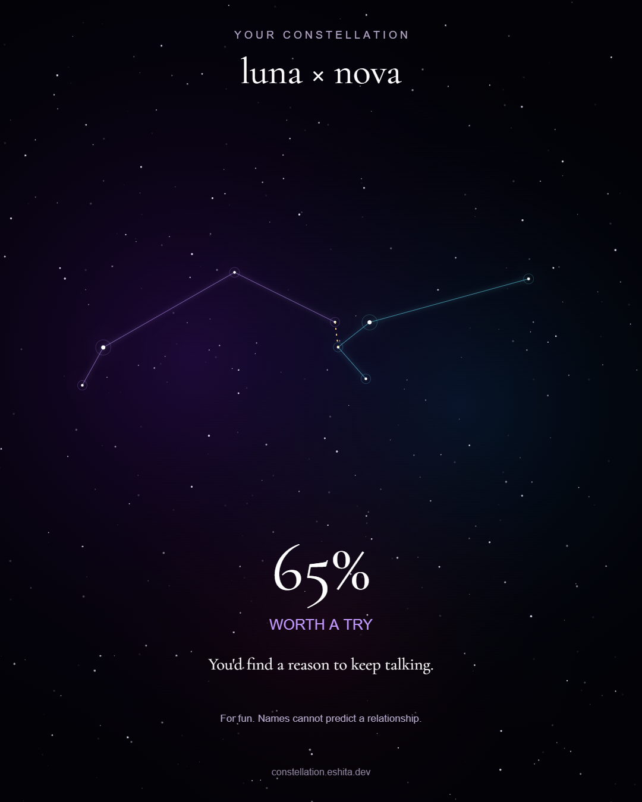

<div align="center">

# ✦ Your Constellation

**A name becomes a star map. Add another and compare.**

### [Open constellation.eshita.dev ↗](https://constellation.eshita.dev)

[How it works](#how-it-works) · [Run locally](#run-locally) · [Deploy](#deploy) · [Report a bug](https://github.com/eshitakundu/constellation-app/issues)



_An example of the downloadable result card._

</div>

## The experience

| Create                                                      | Compare                                                            | Share                                                                         |
| ----------------------------------------------------------- | ------------------------------------------------------------------ | ----------------------------------------------------------------------------- |
| Enter a name to reveal its constellation across the screen. | Add a second name for two colored star maps, a score, and a quote. | Save a portrait PNG, copy a result link, or invite someone to add their name. |

- **Animated sky:** randomly scattered background stars, independent slow twinkles, gentle drift, glowing nodes, and lines that draw themselves.
- **Consistent results:** the same name makes the same pattern. Reversing a pair keeps its score.
- **62 distinct quotes:** every possible percentage, from 38% to 99%, has its own line.
- **Full-screen results:** centered layouts on desktop and mobile, with keyboard navigation and reduced-motion support.
- **Local processing:** names stay in the browser. No accounts, database, analytics, or generation API.
- **Self-hosted fonts:** Cinzel Decorative and Cormorant Garamond, with their OFL licenses included.

Compatibility is a name-based game, not a relationship assessment. Share links and exported images include the names entered.

## How it works

1. Each character's code point and position determine a star's coordinates and size.
2. A minimum spanning tree joins the stars without loops. The renderer centers the pattern and animates the connections.
3. For a pair, a hash of the sorted, normalized names selects a score. That percentage selects its quote.
4. Names in shared links are stored after `#` in the URL. The browser reads them locally; they are not part of the normal HTTP page request.

The decorative background is randomized on each visit. The named constellations and pair scores are repeatable.

## Run locally

```sh
python -m http.server 8080 --directory frontend
```

Open [localhost:8080](http://localhost:8080). There is no install or build step.

Run the behavior checks with Node:

```sh
node --test tests/*.test.cjs
```

Checks cover input limits, Unicode, connected trees, repeatable pair scores, and a distinct quote for every supported percentage.

## Deploy

**Website:** [constellation.eshita.dev](https://constellation.eshita.dev)

Cloudflare Pages can publish the repository directly:

| Setting           | Value           |
| ----------------- | --------------- |
| Production branch | `main`          |
| Framework         | None            |
| Root directory    | Repository root |
| Build command     | `exit 0`        |
| Output directory  | `frontend`      |

See [DEPLOYMENT.md](DEPLOYMENT.md) for domain setup, checks, and AdSense steps.

## AdSense preparation

The site includes explanatory content, FAQ, About, Contact, Privacy, Terms, canonical URLs, a sitemap, robots.txt, and a custom 404 page. These support a usable, crawlable website; they do not guarantee AdSense approval.

**Ads are not enabled.** Owner verification, the real publisher ID and ads.txt record, consent integration, and Google's site review still need to be completed. The deployment guide records the remaining steps.

## Project map

```text
frontend/
  index.html          Generator, full-screen results, and explanations
  constellation.js    Character-to-star mapping and tree connections
  compatibility.js    Pair scores and one quote per percentage
  sketch.js           Animation, PNG export, and sharing
  style.css           Responsive layout and typography
  fonts/              Self-hosted fonts and their licenses
  about.html          Project information
  contact.html        Feedback and contact route
  privacy.html        Current data practices
  terms.html          Terms of use
  sitemap.xml         Public page URLs
tests/                Generator and compatibility checks
docs/preview.png      Example export shown above
backend/              Original FastAPI implementation; not deployed
```

Built with HTML, CSS, JavaScript, and the Canvas API. The static site has no runtime package dependencies.
